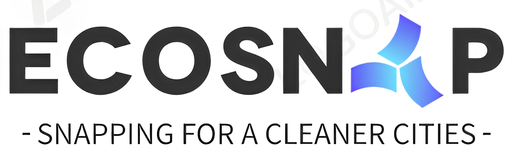
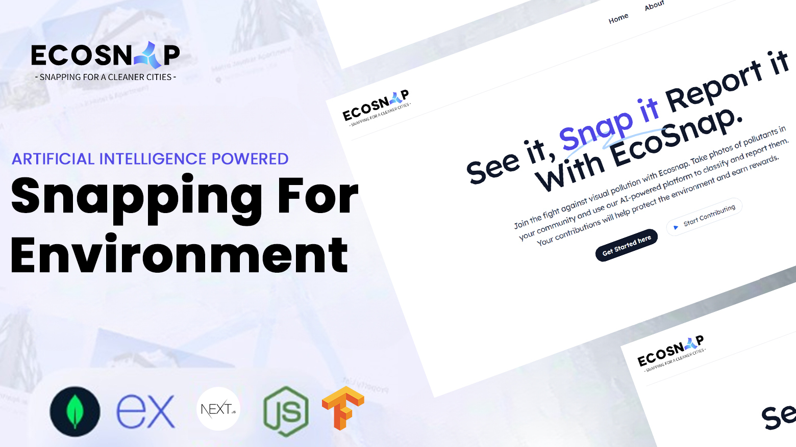

 
 

    <h2>See it, Snap it, Report it.</h2>

 

## Playground link
[playground](https://yash-1511-ecosnap-ai-app-hzz1pr.streamlit.app/)
# EcoSnap

Ecosnap is a crowdsourcing platform that allows users to contribute to environmental monitoring by capturing and sharing images of visual pollution. Using advanced AI technology, Ecosnap automatically classifies these images to identify sources of pollution, such as litter, graffiti, or damaged infrastructure. The platform provides real-time monitoring and visual analytics to support environmental management and inform decision-making.

# Problem
Visual pollution is a serious environmental issue that affects urban areas and natural landscapes worldwide. Traditional methods of pollution monitoring rely on manual observations and limited data sources, leading to inefficient and inaccurate results. With Ecosnap, we aim to provide a user-friendly and innovative solution that engages the public in environmental monitoring and contributes to more effective and sustainable environmental management.

# Usage
To use Ecosnap, users must first create an account by signing up with their email address and password. Once logged in, users can browse the available events or create their own, depending on their location and interests. Events are organized by city, and each event has a specific timeframe during which users can contribute images.

Ecosnap uses AI technology to analyze the uploaded images and classify them into different categories of visual pollution. Users can see the results of the analysis in real-time and track their progress and rewards on their profile dashboard. Ecosnap also provides a map-based visualization of the pollution data, allowing users to explore the distribution and severity of pollution across different locations and time periods.

# Features

- Sign up and login with email and password
- Browse and join events organized by city and category
- Capture and upload images of visual pollution using the Ecosnap app or camera roll
- Automated visual pollution classification using AI technology
Real-time feedback and rewards for valid image contributions

- Profile dashboard to track progress and rewards

# Future Development
In the future, we plan to expand the functionality of Ecosnap to include additional features, such as:

- Map-based visualization of pollution data
- Integration with social media platforms to increase user engagement and outreach
- Gamification elements to incentivize and reward user participation
- Integration with other environmental data sources to provide more comprehensive and accurate environmental monitoring
- Collaboration with local and regional environmental organizations and agencies to support policy and decision-making processes
- Development of additional AI models to detect and classify other types of pollution and environmental indicators

# Technologies Used
- Next.js
- Tailwind CSS
- Node.js
- Express.js
- MongoDB
- AWS Cloud
- TensorFlow

# Contributing
If you would like to contribute to Ecosnap, please follow these steps:

1. Fork the repository
2. Create a new branch for your changes
3. Make your changes and commit them to your branch
4. Push your branch to your forked repository
5. Create a pull request to the main repository

Please ensure that your code is well-documented and adheres to the project's coding standards.

# Contributors
[@Yash Parmar](https://github.com/Yash-1511)

# 🔗 Links

# License
This project is licensed under the MIT License.